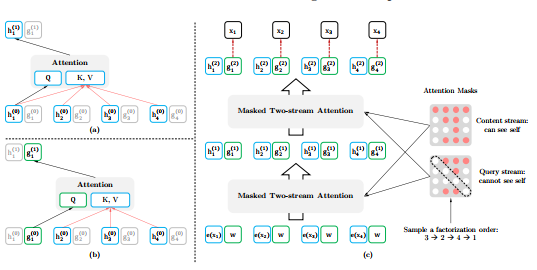

**XLNet: Generalized Autoregressive Pretraining for Language Understanding 论文的中文翻译**
> 转载请注明出处 https://github.com/yuanxiaosc/XLNet_Paper_Chinese_Translation，商用请联系译者 wangzichaochaochao@gmail.com。

如果你认可我的翻译，欢迎点亮右上角星星，感谢 :smiley:

## XLNet 相关资源
> 翻译工作还在进行中，可以先查看以下内容

|标题|说明|时间|
|-|-|-|-|
|[XLNet: Generalized Autoregressive Pretraining for Language Understanding](https://arxiv.org/abs/1906.08237)|原始论文|20190619|
|[xlnet](https://github.com/zihangdai/xlnet)|官方实现|持续更新|
|[拆解XLNet模型设计，回顾语言表征学习的思想演进](https://www.jiqizhixin.com/articles/2019-06-29-3)|追一科技 Tony|20190629|
|[XLNet:运行机制及和Bert的异同比较](https://zhuanlan.zhihu.com/p/70257427)|张俊林，知乎专栏|20190622|

---

# XLNet：广义自回归预训练语言模型

## 摘要

由于具有双向上下文建模的能力，像BERT这样基于自动去噪的预训练语言模型比基于自回归的预训练语言模型的性能更好。然而，依赖于使用带掩码损坏的输入，BERT忽略了掩码位置之间的依赖性，进而受到了预训练-微调不一致的影响。根据这些优点和缺点，我们提出了XLNet，一种广义自回归预训练方法，它（1）通过最大化输入序列的因式分解的所有排列的似然函数的期望来学习双向上下文，并且（2）由于其自回归方法，克服了BERT的局限性。此外，XLNet将最先进的自回归模型Transformer-XL的思想整合到预训练中。实验表明，XLNet在20个任务上常大幅度优于BERT的表现，并在18个任务中实现最先进的结果，包括问答、自然语言推理、情感分析和文档排名。

## 1 介绍

无监督表示学习在自然语言处理领域非常成功[7,19,24,25,10]。通常，这些方法首先在大规模的未标记文本语料库上预训练神经网络，然后在下游任务中微调模型或对模型输出的表示进行优化。在这个共享的高层次思想下，文献中探讨了不同的无监督预训练目标。其中，自回归autoregressive（AR）和自编码autoencoding（AE）语言模型是两个最成功的预训练目标。

AR语言模型试图用自回归模型估计文本语料库的概率分布[7,24,25]。具体而言，给定文本序列 $x=(x_1,...,x_T)$，AR语言模型将似然函数因式分解为一个向前的乘积 $p(x)=\prod_{t=1}^Tp(x_t|x_{<t})$ 或者一个向后的乘积 $p(x)=\prod_{t=T}^1p(x_t|x_{>t})$ 。训练参数模型（例如，神经网络）来拟合每个条件分布。 由于AR语言模型仅经过训练来编码单方向内容（向前或向后），因此无法有效建模深度双向上下文。 然而，下游语言理解任务通常需要双向上下文信息。这导致AR语言模型与有效预训练之间存在差距。

相比之下，基于AE的预训练模型不执行显式密度估计，而是旨在从损坏的输入重建原始数据。 一个值得注意的例子是BERT[10]，它是最先进的预训练方法。给定输入tokens序列，tokens的某一部分被特殊符号[MASK]替换，并且训练该模型以从损坏的版本中恢复原始tokens。由于密度估计不是训练目标的一部分，因此允许BERT利用双向上下文来重建原始输入。作为一个直接的好处，这将弥补前面提到的AR语言模型与有效预训练之间存在差距，从而提高了性能。 然而，在训练期间，BERT在预训练时使用的[MASK]等人造符号在实际数据中不存在，从而导致预训练-微调的不一致。 此外，由于预测的tokens在输入中被遮蔽，因此BERT不能像在AR语言模型中那样使用乘积规则来建模联合概率。换句话说，BERT假设要预测的tokens在给定未遮蔽的tokens的条件下彼此独立，由于自然语言高度有序，长距离依赖广泛存在于自然语言中，因此该假设简化过度了[9]。

面对现有语言预训练目标的优缺点，在这项工作中，我们提出了XLNet，这是一种广义的自回归方法，它充分利用了AR和AE语言模型的优点，同时避免了它们的局限性。
+ 第一，不是像传统的AR模型那样使用固定的前向或后向序列因式分解顺序，XLNet最大化有关序列所有可能的因式分解的排列的对数似然函数的期望。由于排列操作，每个位置的上下文可以包括来自左侧和右侧的tokens。可以预计，每个位置都要学会利用来自所有位置的上下文信息，即捕获双向上下文。
+ 第二，作为一种通用的AR语言模型，XLNet不依赖于数据损坏。因此，XLNet不会遭受BERT中存在的预训练-微调差异的影响。同时，自回归目标还提供了一种自然的方式来使用乘积规则来分解预测的tokens的联合概率，从而消除了在BERT中做出的独立性假设。

除了新的预训练目标外，XLNet还改进了预训练的模型结构设计。
+ 受到AR语言模型的最新进展的启发，XLNet集成了分段循环机制和相关的Transformer-XL编码模式到预训练中，这在实验中改善了性能，特别是对于涉及较长文本序列的任务。
+ 直接地将Transformer（-XL）结构应用于基于排列的语言模型不起作用，因为分解顺序是任意的并且目标是不明确的。为了解决这个问题，我们提出重新参数化Transformer（-XL）网络来消除歧义。

实验中，XLNet在18个任务上实现了最先进的结果，即7个GLUE语言理解任务，3个阅读理解任务，包括SQUAD和RACE，7个文本分类任务，包括Yelp和IMDB，以及ClueWeb09-B文档排名任务。在一系列公平的比较实验中，XLNet在多个基准测试中始终优于BERT[10]。

**相关工作** 在[32,11]中已经探讨了基于排列的AR建模的想法，但是存在几个关键的差异。以前的模型是无序的，而XLNet本质上在位置编码上顺序敏感的。 这对于语言理解很重要，因为无序模型退化为次袋模型，缺乏基本的表达能力。上述差异源于动机的根本不同——之前的模型旨在通过在模型中加入“无序”归纳偏置来改进密度估计，而XLNet的动机是让AR语言模型来学习双向上下文。

$$\max\limits_{\theta} \log{p_{\theta}(x)}=\sum\limits_{t=1}^T \log{p_{\theta}(x_t|x_{<t})}=\sum\limits_{t=1}^T\log{\dfrac{\exp(h_{\theta}(x_{1:t-1})^Te(x_t))}{\sum_{x'}\exp(h_{\theta}(x_{1:t-1})^Te(x'))}},(1)$$

## 2 提出的方法

### 2.1 背景
在本节中，我们首先回顾并比较传统的AR语言模型和BERT语言模型的预训练过程。给定一个文本序列 $x=[x_1,...,x_T]$，AR语言模型通过最大化前向自回归因式分解的似然函数来进行预训练：

其中$h_{\theta}(x_{1:t-1})$是一个由神经模型产生的上下文表示，例如RNNs或者Transformers，$e(x)$表示$x$的嵌入。相比之下，BERT基于去噪自动编码。具体地说，对于文本序列$x$，BERT首先通过将$x$中的一部分（例如15％）tokens随机设置为特殊符号[MASK]来构造损坏版本$\hat x$。用$\overline x$表示遮蔽的tokens。训练目标是从$\hat x$中重建$\overline x$：

其中$m_t=1$表示$x_t$被遮蔽了，$H_{\theta}$是一个Transformer，它把一个长度为$T$的文本序列映射为一个隐藏向量序列$H_{\theta}=[H_{\theta}(x)_1,H_{\theta}(x)_2,...,H_{\theta}(x)_T]$。两个预训练目标的优缺点在以下几个方面进行了比较：
+ 独立性假设：正如公式（2）$\approx$ 符号后所强调的那样，BERT基于所有被遮蔽tokens $\overline x$独立性假设单独重建每一个被遮蔽token，来对联合条件概率$p(\overline x|\hat x)$进行因式分解。相比之下，AR语言模型目标（1）在没有这种独立性假设的情况下使用一般的乘积规则进行因式分解。
+ 输入噪音：BERT的输入包含[MASK]等人造符号，这些符号从未出现在下游任务中，从而产生预训练-微调差异。在[10]中用原始tokens替换[MASK]的方法并不能解决问题，因为原始tokens只能以很小的概率使用——否则公式（2）将是微不足道的优化。相比之下，AR语言模型不依赖于任何输入损坏，也不会遇到此问题。
+ 上下文依赖：AR表示$h_{\theta}(x_{1:t-1})$仅以到tokens $t$前一个位置为条件（即，左边的tokens），而BERT表示$H_\theta(x)_t$可以访问两侧的上下文信息。 因此，BERT目标允许预训练模型以更好地捕获双向上下文。

### 2.2 目标：排列语言模型（Permutation Language Modeling）

> 图 1：给定同一个输入序列$x$但是不同的因式分解顺序的情况下，排序语言模型预测目标是$x_3$的图解。

根据上面的比较，AR语言模型和BERT都具有独特的优势。 一个自然要问的问题是，是否存在一个预训练目标，即在避免其两者弱点的同时具有两者的优势。

采用无序NADE [32]的思想，我们提出了排列语言模型的目标，它不仅保留了AR模型的优点，而且还允许模型捕获双向上下文。具体来说，对于长度为$T$的序列$x$，有$T!$种不同顺序去执行一个有效的自回归因式分解。直觉上，如果模型参数在所有因式分解顺序中共享，可以预计，模型将学会从双方向的所有位置收集信息。

为了形式化这个想法，用$Z_T$表示长度为$T$索引序列的所有可能排序的集合。我们使用$z_t$和$z_{<t}$分别表示索引排序的第$t$个元素和前$t-1$个元素，$z \in Z_T$。然后，我们提出的排列语言模型目标函数可以表示如下：

本质上，对于文本序列$x$，我们对因式分解顺序$z$进行一次采样，并根据因式分解顺序分解似然函数$p_\theta(x)$。 由于在训练期间在所有因子分解顺序中共享相同的模型参数$\theta$，可以预计，$x_t$已经看到序列中的每个可能元素$x_i \neq x_t$，因此能够捕获双向上下文。 此外，由于这个预训练目标满足AR框架，它自然地避免了2.1节中讨论的独立性假设以及预训练-微调不一致问题。

**关于排列的备注** 提出的预训练目标只会排列因式分解索引顺序，而不是序列顺序。换句话说，我们保持原始序列顺序，使用对应于原始序列的位置编码，并依赖Transformer中的适当注意掩码来实现因式分解索引顺序的排列。 请注意，此选择是必要的，因为模型在微调期间只会遇到具有自然顺序的文本序列。

为了提供一个完整的视角，在图1中，我们举了一个在给定同一个输入序列$x$但是不同的因式分解顺序情况下预测token $x_3$的例子。

### 2.3 结构：用于目标敏感表示的双流自注意力（Two-Stream Self-Attention）

> 图2：（a）：内容流注意力（Content stream attention），这与标准的自注意力（self-attention）是一样的。（b）：查询流注意力（Query stream attention），它没有关于内容$x_{z_t}$的访问信息。（c）：具有双流注意的排序语言模型的训练概述。

虽然排序语言模型目标具有所需的属性，但使用标准的Transformer参数设定可能不起作用。看看问题所在，假设我们使用标准的Softmax公式参数化下一个token的分布$p_{\theta}(X_{z_t}|x_{z<t})$，即，$p_{\theta}(X_{z_t}=x|x_{<t})=\dfrac{\exp(e(x)^Th_{\theta}(x_{z<t})}{\sum_{x'}\exp(\exp(e(x')^Th_{\theta}(x_{z<t})}$，其中$h_{\theta}(x_{z<t})$代表$x_{z<t}$经过共享的Transformer神经网络在适当遮蔽后产生的隐藏表示。现在注意到隐藏表示$h_{\theta}(x_{z<t})$不取决于它将要预测的位置，也就是$z_t$的值。因此同样的分布用来预测而不管预测的位置，这将不能学到有用的表示（具体示例见附录A.1）。为了避免这个问题，我们提出重新参数化下一个token分布，以实现对目标位置敏感：

其中$g_{\theta}(x_{z<t, z_t})$代表一种新类型的表示，它把目标位置$z_t$作为输入添加进去。

**双流自注意力** 虽然目标敏感表示的想法消除了目标预测中的模糊性，但是如何形式化$g_{\theta}(x_{z<t, z_t})$仍然是一个棘手的问题。在多种可能的方法中，我们提出“站在”目标位置$z_t$并且依靠这个位置$z_t$通过注意力来收集上下文$x_{z<t}$的信息。要使此参数化起作用，在标准Transformer体系结构中存在两个相互矛盾的要求：（1）预测token$x_z, g_{\theta}(x_{z<t, z_t})$应该只使用位置$z_t$而不使用内容$x_{z_t}$，否则目标变得无效；（2）预测其它tokens $x_{z_j}$ 当$j>t, g_{\theta}(x_{z<t, z_t})$ 时应该编码$x_{z_t}$的内容以便获取所有的上下文信息。为了解决这种矛盾，我们提出使用两组隐藏的表示而不是一组：
+ 内容表示$h_{\theta}(x_{z \leq t})$，或者缩写为$h_{z_t}$，其作用与Transformer中的标准隐藏状态类似。这个表示编码上下文和$x_{zt}$本身。
+ 查询表示$g_{\theta}(x_{z<t, z_t})$，或者简写为$g_{z_t}$，其只能获取上下文信息$x_{z<t}$和位置$z_t$，但是不能获取$x_{z_t}$的内容，如上面的讨论。

计算上，第一层查询流用可训练向量初始化，也就是$g_i^{(0)}=w$，而内容流设置为相应的词嵌入，也就是$h_i^{(0)}=e(x_i)$。对于自注意力的每一层$m=1,...,M$，双流表示用一组共享的参数“示意性”地更新如下（如图2（a）和（b）所示）：

> “示意性”：为了避免混乱，我们省略了实现细节，包括多头注意、残差连接、层正则化、和Transformer（-XL）中使用的位置前馈层。 详情在附录A.2中，以供参考。

其中$Q,K,V$分别表示注意力操作中的查询query、键key和值value。内容表示的更新规则与标准自注意力完全相同，因此在微调时，我们可以简单地删除查询流并将内容流用作普通的Transformer（-XL）。最后，我们可以使用最后层查询表示$g_{z_t}^{(M)}$来计算公式（4）。

**局部预测**  虽然排序语言模型目标（3）具有几个优点，但由于排序和因此导致的在实验初期收敛缓慢，因此它是更具挑战性的优化问题。为了减少优化难度，我们选择仅预测在因式分解顺序最后的tokens。形式化，我们将$z$分解为非目标子序列$z_{\leq c}$和目标子序列$z_{>c}$，其中$c$是切割点。目标是最大化目标子序列在非目标子序列条件下的对数似然函数，即：

注意，选择$z_{>c}$作为目标，因为它在给定当前因式分解顺序$z$的序列中具有最长的上下文。使用超参数$K$，使得选择约$1 / K$ tokens用于预测; 即，$|z| / (|z| - c) \approx K$。对于未选择的tokens，不需要计算它们的查询表示，这样可以节省速度和内存。

后文正在翻译中......